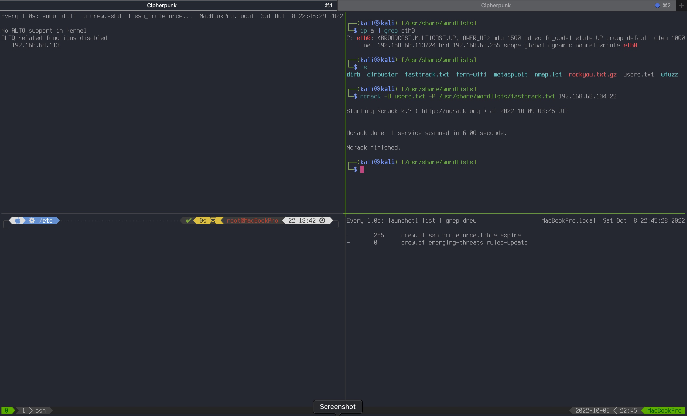

# Ansible role: pf

[![MIT licensed][mit-badge]][mit-link]
[![Galaxy Role][role-badge]][galaxy-link]

Description
----

Ansible role for hardening configuration of pf firewall for MacOS.

[Tutorial used](https://iyanmv.medium.com/setting-up-correctly-packet-filter-pf-firewall-on-any-macos-from-sierra-to-big-sur-47e70e062a0e)


#### PF Anchors
The role will create the following pf anchors:

 - sshd anchor (`<prefix>.sshd.rules`) with bruteforce protection table and rules
 - emerging-treats open ruleset anchor (`<prefix>.eto.rules`) with table of known attackers' IPs and rules for blocking them
 - custom anchors `<prefix>.rdr.rules` and `<prefix>.rdr.rules` with rules specified in `defaults/main.yml`

Those anchors will be loaded in custom `/etc/pf.<prefix>.conf` configuration file.

**NOTE:**
The system default `/etc/pf.conf` on MacOS can be overwritten during system updates, therefore custom `/etc/pf.<prefix>.conf`
will be created and `/etc/pf.conf` may be included in that custom config.

#### Launchd jobs
On MacOS the following Launchd jobs will be created:

 - job for Enabling pf on boot. This is done by creating custom `Library/LaunchDaemon/<>.pf.plist` running `/usr/local/bin/firewall.sh` script for correct pf enabling on MacOS, therefore no [SIP disabling][sip-link] is required
 - job for clearing the ssh_bruteforce table once a day at 10:00pm.
 - job for automated download of ETOpen ruleset once a day at 10:05pm.

Requirements
----
**Reminder:** Ansible uses ssh so make sure the pf configuration does not block ssh
For example:

```
pass in log proto tcp to any port ssh flags S/SA keep state
```

Otherwise you may end up having ssh connection blocked

Role Variables
----
OS-Agnostic:

| Variables | Description | Default|
|-----------|-------------|--------|
| `pf_ssh_bruteforce_protect` | Enable ssh bruteforce protection | `yes` |
| `pf_emerging_threats_protect` | Enable ETOpen Ruleset configuration | `yes` |
| `pf_macros` | Macros variables for pf configuration | see [`defaults/main.yml`](defaults/main.yml) |
| `pf_tables` | pf configuration tables | see [`defaults/main.yml`](defaults/main.yml) |
| `pf_options` | pf configuration options | see [`defaults/main.yml`](defaults/main.yml) |
| `pf_normalization` | pf configuration normalization rules | see [`defaults/main.yml`](defaults/main.yml) |
| `pf_queueing` | pf configuration queueing | see [`defaults/main.yml`](defaults/main.yml) |
| `pf_translation` | Redirect rules for port forwarding and NAT | see [`defaults/main.yml`](defaults/main.yml) |
| `pf_filtering` | Stateful and stateless filtering for rule-based packet blocking or passing | see [`defaults/main.yml`](defaults/main.yml) |

OS-Specific:

| Variables | Description | Default|
|-----------|-------------|--------|
| `pf_conf` | path to main pf configuration file | <ul><li>Darwin: `/etc/pf.prefix.conf`</li><li>Others (BSD): `/etc/pf.conf`</li></ul> |
| `pf_prefix` | just a prefix for customizing the configuration. Will be added to all the filenames, generated by this role | `"{{ ansible_user_id }}"` |

 NOTE: that because of the default value for `pf_prefix` var the role requires Fact Gathering.
 If you override this variable with some static value, the Fact Gathering will not be necessary.

Dependencies
----

None

Example Playbook
----

```yaml
- hosts: dev_clients_macos
  gather_facts: yes
  roles:
  - drew1kun.pf
```

Checking Results (OPTIONAL)
----


### See if pf is Enabled:
```
sudo pfctl -s info | grep Status

No ALTQ support in kernel
ALTQ related functions disabled
Status: Enabled for 0 days 00:20:41           Debug: Urgent
```

### Show the eto and other pf rules loaded:
```
sudo pfctl -s all
```

### Show the launchd jobs loaded:
```
watch -n1 -d 'launchctl list | grep <pf_prefix>'
```


### SSH Bruteforce Table

Start the ssh bruteforce attack from kali machine (192.168.68.113):

**hydra**

```
hydra -l root -P /usr/share/wordlists/fasttrack.txt 192.168.68.104 ssh
```

**medusa**

```
medusa -u root -P /usr/share/wordlists/fasttrack.txt -h 192.168.68.104 -M ssh
```

**ncrack** (most efficient):

```
ncrack -U users.txt -P /usr/share/wordlists/fasttrack.txt 192.168.68.104:22
```

At some point, you may to check to see if you have attackers in your attackers table. To do that, use this command:

```
watch -n1 -d 'sudo pfctl -a drew.sshd -t ssh_bruteforce -T show'
```

This command lists the IPs in the attackers table for the sshd anchor.

On MacOS result will look like this:

```
No ALTQ support in kernel
ALTQ related functions disabled
   192.168.68.113
```

See screenshot:




If you accidentally (or during testing) get a legitimate IP in the attackers table, you can remove it with this command (replace a.b.c.d with your IP):

```
sudo pfctl -a drew.sshd -t ssh_bruteforce -Tdelete a.b.c.d
```
You can also save the existing attackers table and reload it later. This can be useful for saving the table through a system restart. Use the following commands to save the table:

```
sudo pfctl -a drew.sshd -t ssh_bruteforce -Tshow > /etc/pf.attackers-table.txt
```

To load the table later, use this command:

```
sudo pfctl -a drew.sshd -t ssh_bruteforce -Tload -f /etc/pf.attackers-table.txt
```


License
----

[MIT][mit-link]

Author Information
----

Andrew Shagayev | [e-mail](mailto:drewshg@gmail.com)

[role-badge]: https://img.shields.io/badge/role-drew1kun.pf-green.svg
[galaxy-link]: https://galaxy.ansible.com/drew1kun/pf/
[mit-badge]: https://img.shields.io/badge/license-MIT-blue.svg
[mit-link]: https://raw.githubusercontent.com/drew1kun/ansible-pf/master/LICENSE
[sip-link]: https://developer.apple.com/documentation/security/disabling_and_enabling_system_integrity_protection
